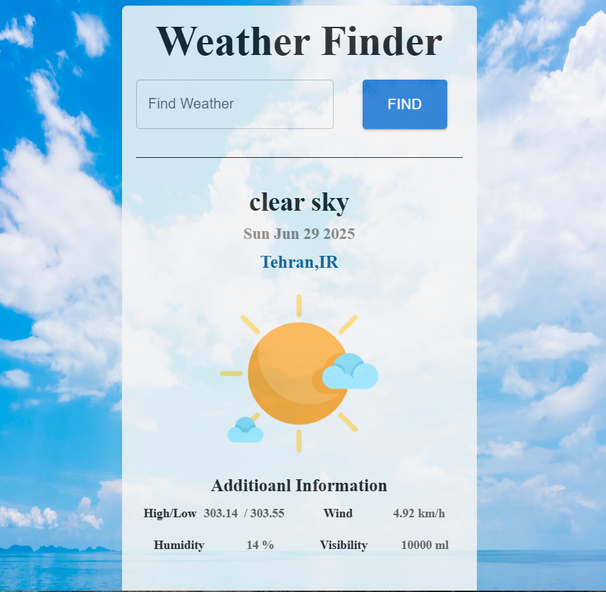

# ☀️ Weather Finder
A responsive weather application built with React, leveraging the OpenWeatherMap API to display current weather data based on the city name entered by the user

# 🔧 Tech Stack
* React with "use client" directive (for Next.js App Router or similar SSR environment)
* React Query (@tanstack/react-query) – for efficient API data fetching and caching
* Axios – for HTTP requests
* MUI (Material UI) – for styled form components
* Tailwind CSS – for responsive, utility-first styling
* OpenWeatherMap API – for real-time weather data
* React Context API – for global state management

  
  # 📦 Features
* 🔍 Search any city and get current weather data
*☁️ Displays: Weather description / Country and city name
* High/Low temperature
*Wind speed
*Humidity
*Visibility
* 🖼 Dynamic weather icon mapping based on conditions (Atmosphere, Extreme, etc.)
* ⚙️ Data fetching with caching and loading/error handling
* 📱 Fully responsive design using Tailwind + MUI


# 🧩 Project Structure 
```bash
components/
├── Main.tsx            # Entry component with layout and state
├── SearchField.tsx     # MUI input field
├── Button.tsx          # Search button (assumed)
├── WeatherDetails.tsx  # Main weather display logic
├── ContextProvider.tsx # Context API setup
├── Loading.tsx         # Spinner component
├── Error.tsx           # Error handling UI
data/
└── weatherImageMap.ts  # Image mapping for weather types
lib/
└── secret.ts           # API key import
```

# 📸 Screenshots


##🌐 API Reference
Docs: https://openweathermap.org/current
